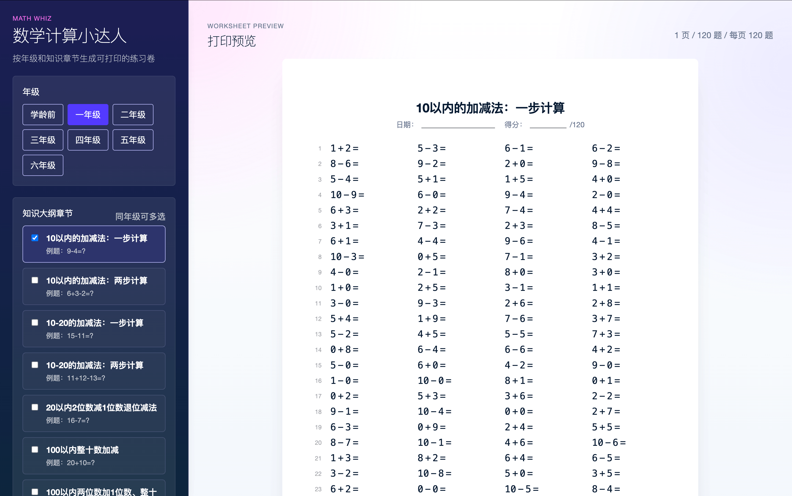
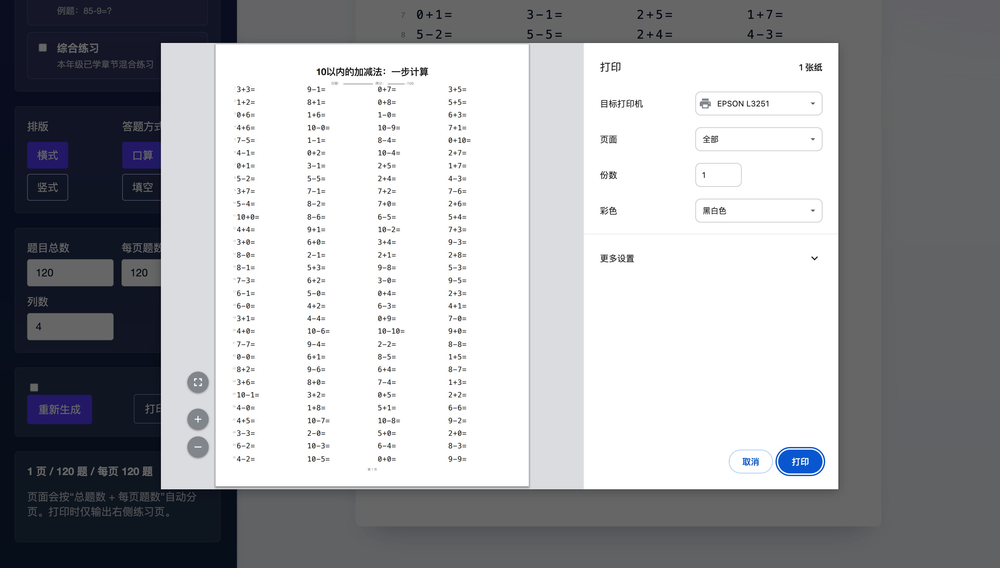

# 数学计算小达人计算题生成器

## 基本原则

1. 出题范围不能超过各年级人教版数学课本的知识大纲
2. 题目和计算结果不能超过选定大纲章节内容，比如“不进位的小数加法”章节之前不能出现小数、六年级才有负数、“两位数除以一位数”章节之前的除法没有余数等等。

## 特性

1. 支持知识大纲章节单选和多选，但不能跨年级。单选时标题为知识大纲章节名称，多选时统一“数学计算”。
2. 支持题目 横式 和 竖式 的切换，注意留足书写结果的空间。
3. 支持题目以 口算 和 填空 的答题方式切换，如口算题：12+34=( ) 切换填空题则为：12+( )=46。
4. 支持自定义题目总数、每页题数、行列的数量，按照总题数和每页题数自动分页，每页题应该完整不能跨页。
5. 支持显示/隐藏答案。
6. 要求排版工整（等宽字体），能快速打印以及打印预览（A4纸张）

## 支持年级

学龄前、一年级、二年级、三年级、四年级、五年级、六年级

Screenshot

